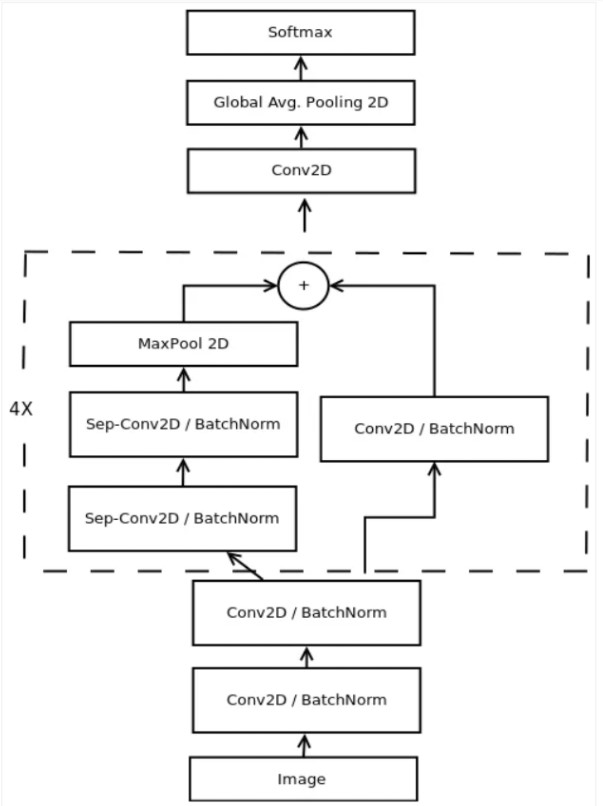
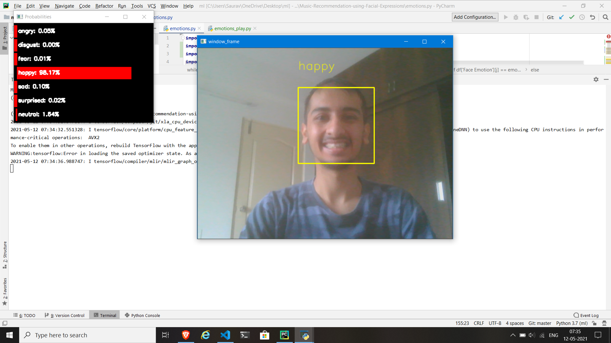
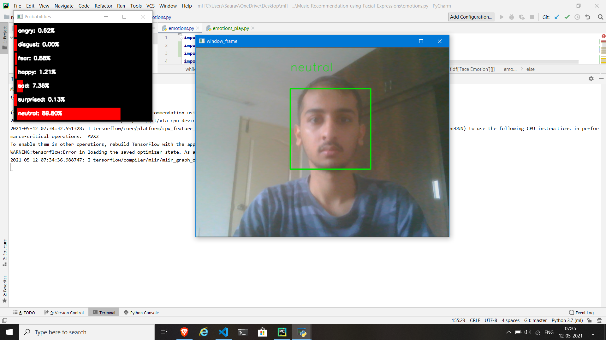
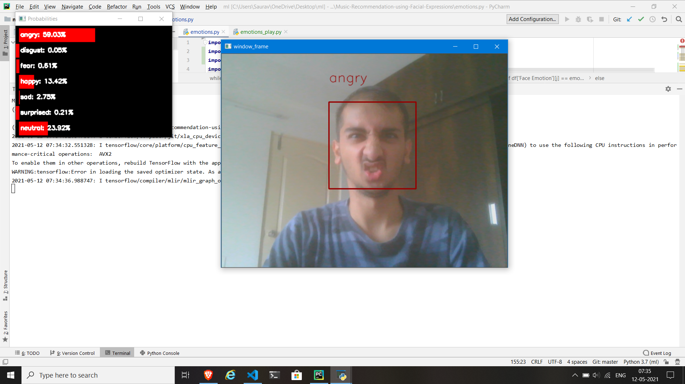
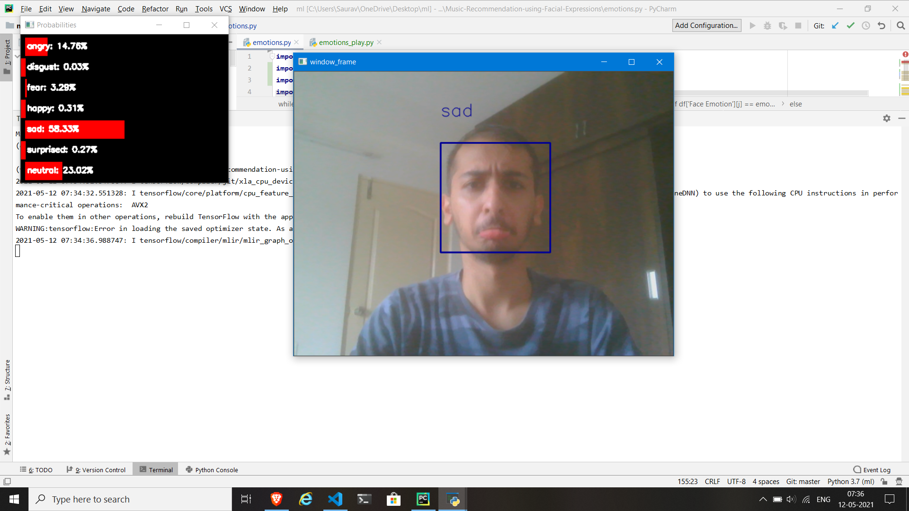
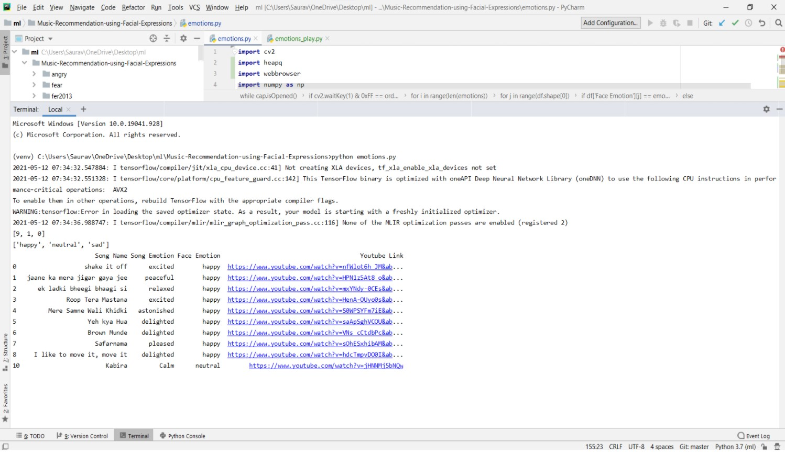
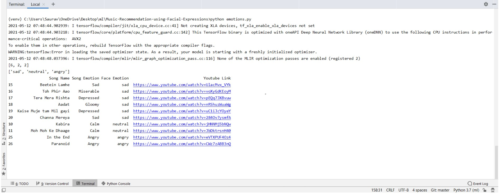
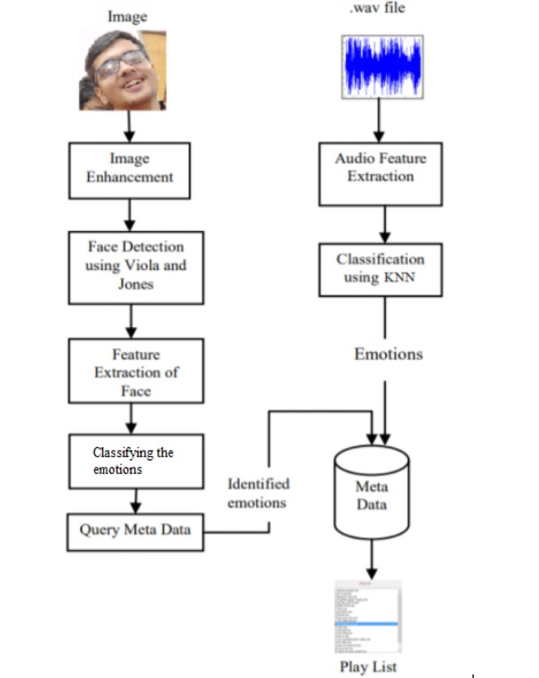

# Music-Recommendation-using-Facial-Expressions
An application which detects our facial emotions at real time using webcam feed and displays playlist of songs according to the mood of the user.

## Models
Models used for:
1. Face Detection - I have implemented [CascadeClassifier](https://docs.opencv.org/3.4/db/d28/tutorial_cascade_classifier.html) model of cv2 library using `haarcascade_frontalface_default.xml` (haarcascade features for face) in models directory.
2. Emotion Prediction - The application provides a pre-trained model `emotion_model.hdf5` in models directory for emotion or mood recognition which has been trained on Kaggle's 'Fer2013' dataset. 

    If you want to train the song prediction you can run `train_emotion_classifier.py`. The output of the model would be saved in the following format:

    ``` python
    trained_models_path = base_path + '_mini_XCEPTION'
    model_names = trained_models_path + '.{epoch:02d}-{val_acc:.2f}.hdf5'
    ```


## Dataset

If you don't want to use the pretrained model, then download the dataset from [here](https://www.kaggle.com/c/challenges-in-representation-learning-facial-expression-recognition-challenge/data).

Make a folder named fer2013 and extract the dataset there (Check `load_and_process.py` file for path).

## Execution
Install the required libraries.

There are 2 ways you can execute:
1. In this python file we have used Output.csv file where there a mapping is done between song emotions and facial emotions. (Emotions of songs can be predicted using [this repo.](https://github.com/Saurav-Kanegaonkar/Song-Emotion-Predictor)). While the camera window is open press **'p'** which will capture a photo and the face emotion will be detected. After the face emotion is predicted we display the songs playlist and YouTube link for the 1st song is opened in the web browser. Note that we haven't included songs for human emotions- fear and surprise. Press **'q'** for 5 seconds to exit.

`python emotions.py`

2. Press **'p'** on the camera window. I have hard coded the playing music part i.e. there are 5 emotion folders having 5 songs each which will be played randomly after any of the 5 emotions are detected(except fear and surprised). Press **'q'** for 5 seconds to exit.

`python emotions_play.py`


## Screenshots

1. Face Detection and Emotion Recognition








<br><br>

2. Song Recommendation
<br>

Ex 1 : Happy




<br><br>

Ex 2 : Sad




<br>

## Mapping between Face Emotions and Song Emotions

| Human Emotion        | Song Emotions           | 
| ------------- |:-------------:|
| Happy      | Excited, Peaceful & Happy |
| Sad      | Sad, Depressing      |
| Neutral | Angry, Peaceful      | 
| Angry | Happy, Excited      | 
| Fear | Peaceful      | 
| Happy - Surprised| Excited  |
| Sad - Surprised| Sad, Depressing  |

<br><br>

